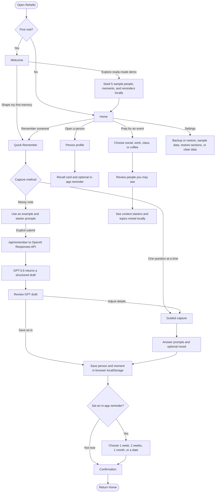
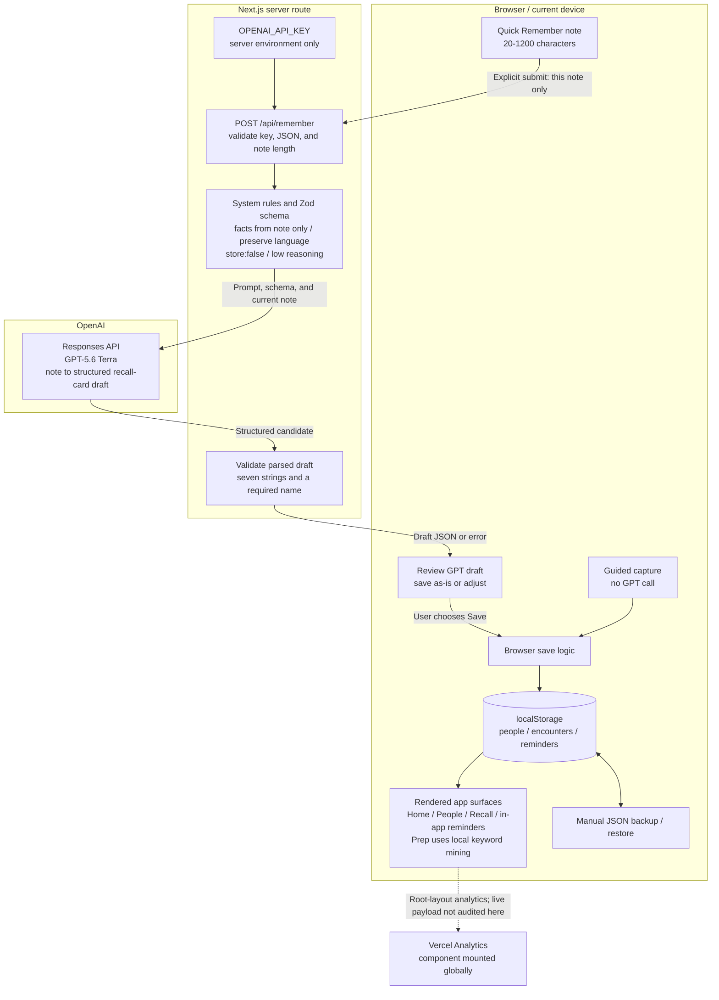

# Rehello

> GPT-5.6 turns messy memories into easier next conversations.

Rehello is a personal social memory web app for introverts and the
socially anxious. At its heart is a GPT-5.6 transformation: drop in
the messy fragments you remember after meeting someone, and Quick
Remember shapes them into a recall card with who they are, what
mattered, and what you could ask next.

The rest of Rehello stays deliberately local-first. There are no
accounts, and saved people, moments, and reminders stay in the
browser. Only a Quick Remember note that the user explicitly submits
is sent through the server-side OpenAI route for shaping.

---

## Why it exists

Most "people tools" are built for salespeople. They assume you want
a pipeline, a deal stage, a follow-up cadence. For someone who finds
socializing genuinely tiring, that framing makes the whole idea of
remembering people feel transactional and worse, not better.

Rehello is the opposite shape:

- **Remember** — a soft, prompt-led capture flow (no blank fields).
- **Recall** — a one-card refresh before you see someone again,
  spaced so you do not over-rehearse.
- **Stay in touch** — a single chip-based picker (a week, two weeks,
  a month, or pick a date) that turns "I should reach out" into a
  one-tap in-app reminder.
- **Prep** — for events, mixers, and coffee chats: a small set of
  conversation starters tuned to the kind of event, plus topics
  mined from your own past encounters.

The whole app is designed to feel like a notebook a kind friend
left on your desk — quiet, warm, never nagging.

---

## Why mobile first

Rehello deliberately ships as one phone-sized, touch-first experience instead
of a separate desktop dashboard. The useful moments rarely happen while someone
is sitting at a desk:

- **Right after meeting someone**, when a few messy details need to be captured
  before they fade.
- **On the way to the next event**, when a short recall card is more useful than
  a large contact database.
- **In the moment someone thinks "I should reach out"**, when setting a gentle
  reminder should take only a few taps.

In those situations, the phone is already with the user and a home-screen PWA
can open without changing context. A desktop-first layout would optimize for
managing records later; Rehello optimizes for remembering and acting while the
social context is still present.

The web app still opens in a desktop browser, but it intentionally keeps the
same narrow phone surface. A separate desktop information architecture is out
of scope for the current MVP so the interaction, copy, and testing can stay
focused on the real usage environment.

---

## Design principles

1. **Low blank-page anxiety.** Every input has a placeholder, an
   example, or a chip set. Nothing ever asks "tell me about this
   person" with an empty box.
2. **Show before ask.** Sections explain what they are for (e.g.
   "people you have not refreshed in a while") so the user is
   never guessing why something appeared.
3. **Reversible by default.** Hide a home section, change the sort,
   reorder by drag — every choice has a Settings escape hatch.
4. **No streaks, no scoring.** There are no badges, no "you missed
   a day" guilt loops, no notifications begging you to come back.
5. **Hand-drawn warmth.** Icons get a subtle wobble filter, the
   palette is warm cream and clay, and the wordmark is a serif with
   a single accent dot — small humanizing details over cold UI.

---

## Feature tour

| Surface | What it does |
| --- | --- |
| **Home** | Greeting that adapts to time of day, a featured person worth refreshing, recall preview, recent people, "worth a quick refresh", and upcoming reminders. Each section can be hidden. |
| **People** | Sortable list (Recent / A–Z / Last met / Custom drag-to-reorder) with search. |
| **Person profile** | Name, tags, color, encounter history, and a "Stay in touch" picker with in-app reminder list. |
| **Remember flow** | Paste one messy note and let GPT-5.6 shape a recall card, or use the original prompt-by-prompt capture flow. |
| **Recall** | Spaced-review card that surfaces what to ask about next time, plus an inline in-app reminder picker. |
| **Prep** | Pick an event type (social mixer / work / class / coffee), get starters tuned to that context plus topics mined from your own conversation history. |
| **Settings** | Back up or restore people, moments, and reminders; restore hidden sections; load sample data; replay Welcome; or clear local data. |

---

## User flow

Only an explicit Quick Remember submission crosses the server boundary. Guided
capture, saved records, reminders, sample data, and Prep topic mining stay in
the browser.



---

## Product architecture and GPT-5.6's role

GPT-5.6 performs one bounded transformation: it turns the single Quick Remember
note the user explicitly submits into a seven-field draft. It is not the app's
database, reminder engine, Prep engine, or long-term memory. The checked code has
no path that automatically uploads saved `localStorage` history to the model.



The seven generated fields are `name`, `oneLiner`, `where`, `impression`,
`talkedAbout`, `memorableDetail`, and `nextTimeAsk`. The server asks the model
to use only facts in the note, avoid sensitive inference, preserve the note's
language, and leave missing fields empty. These instructions and the schema
reduce unwanted output; they do not guarantee factual accuracy.

---

## Current limitations

- **GPT-5.6 has a narrow role.** Only Quick Remember calls it. Guided capture,
  Recall, reminders, sorting, sample data, and Prep topic mining are local,
  deterministic application logic. There is no realtime voice conversation,
  autonomous social assistant, or model access to a person's saved history.
- **Generated drafts can still be wrong.** A prompt and Zod schema constrain
  structure, not truth. Users must review the card before saving and use
  `Adjust the details` when the draft is incomplete or inaccurate.
- **Quick Remember is intentionally limited.** Notes need at least 20 characters
  beyond inserted starter labels, no more than 1,200 total characters, and a
  name. The quick path always creates a new person,
  does not deduplicate existing people, and records the encounter time as the
  save time rather than extracting a meeting date. Its preview does not display
  the generated `impression` field unless the user enters the adjustment flow.
- **Saved data belongs to one browser profile.** There is no account, cloud
  database, or cross-device sync. Clearing site data, using private browsing, or
  losing the device can remove records. Backup and restore are manual JSON
  actions and cover people, encounters, and reminders, not every UI preference.
  The downloaded JSON is not encrypted by Rehello and should be stored privately.
- **Reminders are visible only inside Rehello.** They do not create push, email,
  SMS, calendar, or operating-system notifications. The user must reopen the app
  to see due or upcoming reminders.
- **Local-first does not mean zero external data flow.** The explicitly
  submitted note passes through the Vercel server route to OpenAI. The request
  sets `store:false`, and the route sends `Cache-Control: no-store`, but this
  repository does not prove end-to-end encryption or zero provider retention.
  Vercel Analytics is also mounted globally; its live configuration and payload
  were not audited for this diagram.
- **Availability depends on external services.** Quick Remember needs the
  server-side API key, network access, the deployed route, and OpenAI. The client
  stops waiting after 45 seconds and shows an error; guided capture remains the
  non-AI fallback.
- **Abuse and cost controls are not implemented in the route.** The endpoint is
  unauthenticated and has no repository-level rate limiter. Any Vercel WAF rule,
  provider budget, or billing cap is deployment configuration and was not
  verified by this code audit.
- **PWA does not mean offline.** The repository has PWA manifest metadata but no
  service worker or Workbox implementation. Offline loading is not promised,
  and GPT shaping always requires a network request.
- **Language support is partial.** The model prompt requests output in the
  note's language, but the application interface and error messages are mainly
  English and have no complete localization system.
- **Verification coverage is limited.** CI runs lint and production build only.
  No unit or end-to-end test scripts or conventional test files were found in
  the checked repository, and this
  documentation task did not verify a physical phone, installed PWA, live WAF,
  analytics payload, or production API call.

---

## Tech stack

- **Next.js 16** (App Router, Turbopack)
- **React 19**
- **TypeScript 5**
- **Tailwind CSS 4**
- **lucide-react** for icons
- **@dnd-kit** for drag-to-reorder
- **Vercel Analytics** through `@vercel/analytics`
- **localStorage** for people, encounters, and reminders
- **OpenAI Responses API** with GPT-5.6 Terra for the Quick Remember core

People, encounters, and reminders still persist in `localStorage`.
Quick Remember sends only the note a user explicitly submits to the
server-side API route; the OpenAI key is never exposed to the browser.

The whole app is statically prerendered where possible. Anything
that depends on local data hydrates on the client.

It is also a **PWA** — installable to home screen, standalone
display mode, themed splash, and a serif-monogram icon.

---

## Running it

```bash
cd web
npm install
npm run dev
```

To use Quick Remember locally, copy `.env.example` to `.env.local`
and set `OPENAI_API_KEY`. Never commit `.env.local`.

Open <http://localhost:3000>. On first load, advance to the final
Welcome screen and choose **Explore a ready-made demo** to seed five
sample people with intentionally overlapping conversation themes so
Prep has something interesting to surface.

```bash
npm run build   # production build
npm run lint    # eslint
```

GitHub Actions runs `npm ci`, `npm run lint`, and `npm run build`
on every push and pull request using Node.js 24. The CI workflow does
not receive `OPENAI_API_KEY` and does not make a live OpenAI request.

---

## Documentation

- [`docs/README.md`](docs/README.md) — documentation map and source-of-truth rules
- [`docs/decisions/`](docs/decisions/) — detailed architecture and product decisions
- [`docs/engineering-log/`](docs/engineering-log/) — timestamped engineering evidence
- [`docs/product/`](docs/product/) — product specifications
- [`docs/research/`](docs/research/) — historical feedback and research
- [`docs/prototypes/`](docs/prototypes/) — archived standalone explorations

---

## Project structure

```text
re-hello/
├── docs/
│   ├── decisions/          # ADRs: why a direction was chosen
│   ├── engineering-log/    # Timestamped work and verification records
│   ├── product/            # Product specifications
│   ├── research/           # Historical feedback
│   └── prototypes/         # Early standalone explorations, not deployed
├── web/                    # Current Next.js application
│   ├── public/             # PWA icons and static assets
│   └── src/
│       ├── app/            # Routes and server Route Handlers
│       ├── components/     # Shared interface components
│       └── lib/            # Storage, types, and client utilities
└── README.md
```

All persistence flows through `web/src/lib/storage.ts`. There are no
other places that touch `localStorage` directly, which keeps the
data shape easy to evolve.

---

## Status

This is a launch-stage portfolio project, not a production-grade
service. It explores what a softer people tool could feel like.
There are no accounts or sync; saved people remain in the current
browser. An explicitly submitted Quick Remember note is processed
through the OpenAI API, and Vercel Analytics is enabled for the app.

Feedback and conversation welcome.
