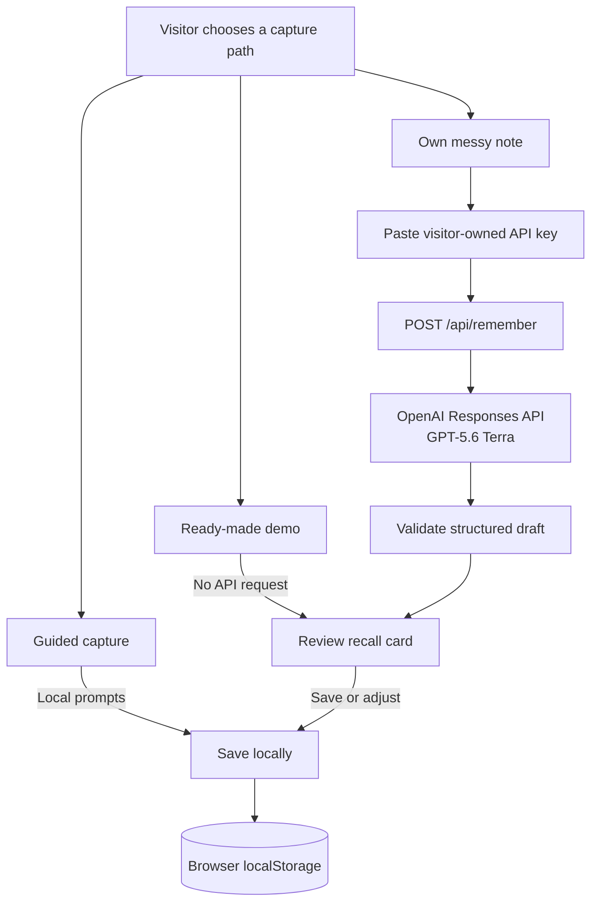

# Rehello

> GPT-5.6 turns messy memories into easier next conversations.

[Open the live app](https://re-hello.vercel.app/) ·
[Try Quick Remember](https://re-hello.vercel.app/remember) ·
[Browse the documentation](docs/README.md)

Rehello is a mobile-first social memory app for introverts and people who find
socializing tiring. Write down the fragments you remember after meeting
someone, and Quick Remember can shape them into a structured recall card:
who they are, what mattered, and what you could ask next.

The app is deliberately local-first. There are no accounts; saved people,
moments, and reminders stay in the current browser. The ready-made demos use
no API. Live AI generation is BYOK: each visitor supplies their own OpenAI API
key for the single request they choose to make.

## Try it

Rehello offers three ways to capture a memory:

| Path | API use | Best for |
| --- | --- | --- |
| **Ready-made demo** | None | Seeing the product immediately without an account, key, or API charge. |
| **Quick Remember with BYOK** | One OpenAI request per attempt | Turning your own messy note into a structured draft with GPT-5.6. |
| **Guided capture** | None | Answering the original prompts one question at a time. |

For a zero-cost product tour, open the live app and choose
**Explore a ready-made demo**, or open Quick Remember and choose
**See a ready-made result**. Both paths are fixed local examples and make no
OpenAI request.

To test the real AI transformation in the deployed app:

1. Open [Quick Remember](https://re-hello.vercel.app/remember).
2. Enter at least 20 characters of your own note.
3. Choose **Use your OpenAI API key once**.
4. Paste a dedicated, restricted OpenAI project key.
5. Review the generated draft before saving it.

The API usage is charged to the visitor's OpenAI project, not the Rehello
project owner. ChatGPT subscriptions do not include API usage.

> **API key safety:** only paste a key into the official deployment you trust.
> Rehello sends the key and current note through its Vercel server route to
> OpenAI for that attempt. The app clears the key afterward and does not write
> it to localStorage, sessionStorage, the URL, or a backup. Do not paste a key
> into an unknown fork, shared computer, screenshot, issue, chat, or source
> file. See [OpenAI's API key safety guidance](https://help.openai.com/en/articles/5112595-best-practices-for-api-key-safety).

## Why Rehello exists

Most people tools are designed like sales software: pipelines, deal stages,
follow-up cadences, and pressure to keep up. Rehello takes the opposite
approach. It is meant to feel like a notebook a kind friend left on your desk:
quiet, warm, and never nagging.

- **Remember** — capture a person without facing a blank form.
- **Recall** — refresh one useful card before seeing someone again.
- **Stay in touch** — turn “I should reach out” into a gentle in-app reminder.
- **Prep** — get context-aware conversation starters for a mixer, work event,
  class, or coffee chat.

There are no streaks, scores, social rankings, or guilt-driven notifications.

## The product

| Surface | What it does |
| --- | --- |
| **Home** | Shows recent people, one person worth refreshing, upcoming reminders, and sections the user can hide. |
| **People** | Searches and sorts by recent, A–Z, last met, or a custom drag order. |
| **Person profile** | Keeps tags, encounter history, recall details, and in-app reminders together. |
| **Remember** | Offers the zero-API demo, BYOK Quick Remember, and the original guided flow. |
| **Recall** | Surfaces what mattered and what might be worth asking next time. |
| **Prep** | Combines event-specific starters with topics mined locally from saved encounters. |
| **Settings** | Backs up or restores core records, loads sample data, restores hidden sections, replays Welcome, or clears local data. |

Rehello is intentionally phone-sized and touch-first, even in a desktop
browser. The useful moment is usually right after meeting someone or just
before seeing them again, not while managing a large contact database at a
desk. The app can also be installed as a PWA, although offline use is not
currently promised.

## How Quick Remember works

Only an explicit BYOK submission crosses the server boundary. Demo cards,
guided capture, saved records, reminders, and Prep topic mining stay in the
browser.



GPT-5.6 performs one bounded transformation: a note of 20–1,200 characters
becomes a seven-field draft:

- `name`
- `oneLiner`
- `where`
- `impression`
- `talkedAbout`
- `memorableDetail`
- `nextTimeAsk`

The server uses the OpenAI Responses API with strict Zod structured output,
low reasoning effort, and `store: false`. Its instructions tell the model to
use only facts from the submitted note, avoid sensitive inference, preserve
the note's language, and leave unknown fields empty. These controls constrain
the output; they do not guarantee that every draft is correct, so the user
reviews the card before saving it.

## Data and API key boundary

| Data | Where it goes |
| --- | --- |
| Ready-made demos | Loaded locally; no OpenAI request. |
| Guided Remember answers | Saved in the current browser. |
| People, encounters, and reminders | Stored in browser localStorage. |
| Prep topics | Derived locally from saved encounter text. |
| Submitted Quick Remember note | Sent through `/api/remember` to OpenAI only after explicit submission. |
| Visitor API key | Held in React state for the attempt, sent in a custom request header, then cleared. |
| Manual backup | Downloaded as readable JSON; it does not contain the API key. |

Additional boundaries:

- The server route does not read or fall back to a project-owner
  `OPENAI_API_KEY`.
- The response uses `Cache-Control: no-store`.
- Rehello includes no third-party analytics script.
- Saved history is not automatically uploaded to the model.
- The application code does not persist the visitor's API key.

“Local-first” does not mean “nothing leaves the device.” A real Quick Remember
request sends the submitted note and visitor-provided key through the deployed
Vercel Function to OpenAI. The repository does not claim end-to-end encryption
or zero provider retention beyond the configured `store: false` request.

## Architecture

```text
Browser
├── Next.js / React interface
├── localStorage
│   ├── people
│   ├── encounters
│   └── reminders
├── fixed demo fixtures
└── explicit BYOK request
    └── POST /api/remember
        └── OpenAI Responses API
            └── validated recall-card draft
```

The main stack is:

- Next.js 16 with App Router and Turbopack
- React 19 and TypeScript 5
- Tailwind CSS 4
- OpenAI JavaScript SDK and Responses API
- Zod structured output validation
- Vitest
- `@dnd-kit` for custom people ordering
- `lucide-react` for icons

## Run locally

```bash
cd web
npm install
npm run dev
```

Open <http://localhost:3000>.

No API key is required to run the app, explore the ready-made demo, use guided
capture, or run the automated checks. To make a live Quick Remember request,
paste a dedicated OpenAI project key into the one-time BYOK field in the app.
Do not add a key to the repository.

```bash
npm test
npm run lint
npm run build
```

GitHub Actions runs `npm ci`, tests, lint, and a production build on Node.js 24
for every push and pull request. CI receives no OpenAI API key, and route tests
mock the OpenAI client rather than making a paid request.

## Current limitations

- Saved records belong to one browser profile. There is no account, cloud
  database, or cross-device sync.
- Clearing site data or using a temporary browser profile can remove records.
  Backup and restore are manual JSON operations.
- The backup file is readable JSON and is not encrypted by Rehello.
- Reminders appear only inside Rehello; there are no push, email, SMS,
  calendar, or operating-system notifications.
- Quick Remember always creates a new person and does not deduplicate existing
  records.
- Generated drafts can still be incomplete or wrong and must be reviewed.
- The interface is mainly English, although the model is asked to preserve the
  submitted note's language.
- The deployed BYOK route avoids owner-funded OpenAI usage but can still consume
  Vercel Function invocations. Same-origin checking is not authentication, and
  there is no repository-level distributed rate limiter.
- The PWA has install metadata but no service worker, Workbox implementation,
  or offline guarantee.

## Verification and deployment status

The BYOK and zero-API implementation is covered by route and demo-fixture tests,
lint, and a production build. Browser verification confirmed that the demo path
makes no `/api/remember` request and that the API key is absent from browser
storage, the URL, and downloaded backups.

The production deployment serves the merged BYOK version at
[re-hello.vercel.app](https://re-hello.vercel.app/). On 2026-07-23, its
homepage returned HTTP 200 after all 35 older Vercel deployments were removed.
That availability check was not a paid production OpenAI request.

Detailed evidence:

- [BYOK and zero-API demo](docs/engineering-log/2026-07-22-byok-zero-api-demo.md)
- [BYOK architecture decision](docs/decisions/ADR-0008-byok-and-zero-api-demo.md)
- [Vercel deployment cleanup](docs/engineering-log/2026-07-23-vercel-deployment-cleanup.md)

## Documentation

- [`docs/README.md`](docs/README.md) — documentation map and source-of-truth rules
- [`docs/decisions/`](docs/decisions/) — architecture and product decisions
- [`docs/engineering-log/`](docs/engineering-log/) — timestamped implementation
  and verification evidence
- [`docs/product/`](docs/product/) — product specifications
- [`docs/research/`](docs/research/) — historical feedback and research
- [`docs/prototypes/`](docs/prototypes/) — archived standalone explorations

## Status

Rehello is a live, launch-stage portfolio project rather than a
production-grade service. It demonstrates a bounded GPT-5.6 transformation
inside a softer local-first people tool, while giving every visitor a useful
zero-API way to explore it.
